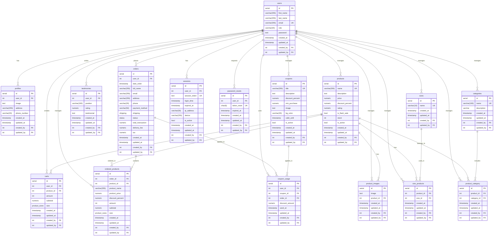

# ERD Daily Greens

```mermaid
erDiagram
    users {
        serial id PK
        varchar(255) first_name
        varchar(255) last_name
        varchar(255) email UK
        varchar(20) role
        text password
        timestamp created_at
        timestamp updated_at
        int created_by FK
        int updated_by FK
    }

    profiles {
        serial id PK
        int user_id FK
        text image
        varchar(255) address
        varchar(20) phone_number
        timestamp created_at
        timestamp updated_at
        int created_by FK
        int updated_by FK
    }

    carts {
        serial id PK
        int user_id FK
        int product_id FK
        int amount
        numeric subtotal
        product_sizes size
        timestamp created_at
        timestamp updated_at
        int created_by FK
        int updated_by FK
    }

    products {
        serial id PK
        varchar(255) name UK
        text description
        numeric price
        numeric discount_percent
        numeric rating
        bool is_flash_sale
        int stock
        bool is_active
        timestamp created_at
        timestamp updated_at
        int created_by FK
        int updated_by FK
    }

    product_images {
        serial id PK
        text image
        int product_id FK
        timestamp created_at
        timestamp updated_at
        int created_by FK
        int updated_by FK
    }

    sizes {
        serial id PK
        varchar(10) name UK
        timestamp created_at
        timestamp updated_at
        int created_by FK
        int updated_by FK
    }

    size_products {
        serial id PK
        int product_id FK
        int size_id FK
        timestamp created_at
        timestamp updated_at
        int created_by FK
        int updated_by FK
    }

    testimonies {
        serial id PK
        int user_id FK
        varchar(100) position
        numeric rating
        text testimonial
        timestamp created_at
        timestamp updated_at
        int created_by FK
        int updated_by FK
    }

    orders {
        serial id PK
        int user_id FK
        timestamp date_order
        varchar(255) full_name
        varchar(255) email
        varchar(255) address
        varchar(20) phone
        varchar(50) payment_method
        shipping shipping
        status status
        numeric total_transaction
        numeric delivery_fee
        numeric tax
        timestamp created_at
        timestamp updated_at
        int created_by FK
        int updated_by FK
    }

    ordered_products {
        serial id PK
        int order_id FK
        int product_id FK
        varchar(255) product_name
        numeric product_price
        numeric discount_percent
        int amount
        numeric subtotal
        product_sizes size
        timestamp created_at
        timestamp updated_at
        int created_by FK
        int updated_by FK
    }

    sessions {
        serial id PK
        int user_id FK
        text session_token UK
        timestamp login_time
        timestamp expired_at
        varchar(30) ip_address
        varchar(255) device
        bool is_active
        timestamp created_at
        timestamp updated_at
        int created_by FK
        int updated_by FK
    }

    password_resets {
        serial id PK
        int user_id FK
        char(6) token_reset UK
        timestamp expired_at
        timestamp created_at
        timestamp updated_at
        int created_by FK
        int updated_by FK
    }

    categories {
        serial id PK
        varchar(100) name UK
        varchar description
        timestamp created_at
        timestamp updated_at
        int created_by FK
        int updated_by FK
    }

    product_category {
        serial id PK
        int product_id FK
        int category_id FK
        timestamp created_at
        timestamp updated_at
        int created_by FK
        int updated_by FK
    }

    coupons {
        serial id PK
        varchar(255) title UK
        text description
        numeric discount_percent
        numeric min_purchase
        text image
        varchar(20) bg_color
        timestamp valid_until
        bool is_active
        timestamp created_at
        timestamp updated_at
        int created_by FK
        int updated_by FK
    }

    coupon_usage {
        serial id PK
        int user_id FK
        int coupon_id FK
        int order_id FK
        numeric discount_amount
        timestamp used_at
        timestamp updated_at
        int created_by FK
        int updated_by FK
    }

    users ||--o{ profiles : has
    users ||--o{ carts : creates
    users ||--o{ testimonies : writes
    users ||--o{ orders : places
    users ||--o{ sessions : has
    users ||--o{ password_resets : requests
    users ||--o{ coupon_usage : uses

    users ||--o{ products : manages
    users ||--o{ product_images : manages
    users ||--o{ ordered_products : manages
    users ||--o{ sizes : manages
    users ||--o{ size_products : manages
    users ||--o{ categories : manages
    users ||--o{ product_category : manages
    users ||--o{ coupons : manages

    products ||--o{ carts : added_to
    products ||--o{ product_images : has
    products ||--o{ size_products : has
    products ||--o{ ordered_products : ordered_in
    products ||--o{ product_category : belongs_to

    orders ||--o{ ordered_products : contains
    orders ||--o{ coupon_usage : applied_to

    sizes ||--o{ size_products : used_in

    categories ||--o{ product_category : includes

    coupons ||--o{ coupon_usage : applied_in
```
