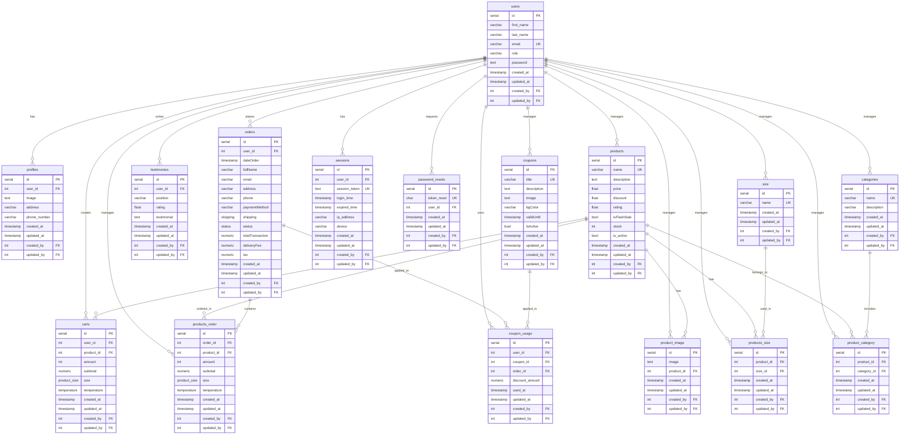

# ERD Daily Greens

```mermaid
erDiagram
    users {
        serial id PK
        varchar first_name
        varchar last_name
        varchar email UK
        varchar role
        text password
        timestamp created_at
        timestamp updated_at
        int created_by FK
        int updated_by FK
    }

    profiles {
        serial id PK
        int user_id FK
        text image
        varchar address
        varchar phone_number
        timestamp created_at
        timestamp updated_at
        int created_by FK
        int updated_by FK
    }

    carts {
        serial id PK
        int user_id FK
        int product_id FK
        int amount
        numeric subtotal
        product_size size
        temperature temperature
        timestamp created_at
        timestamp updated_at
        int created_by FK
        int updated_by FK
    }

    products {
        serial id PK
        varchar name UK
        text description
        float price
        float discount
        float rating
        bool isFlashSale
        int stock
        bool is_active
        timestamp created_at
        timestamp updated_at
        int created_by FK
        int updated_by FK
    }

    product_image {
        serial id PK
        text image
        int product_id FK
        timestamp created_at
        timestamp updated_at
        int created_by FK
        int updated_by FK
    }

    size {
        serial id PK
        varchar name UK
        timestamp created_at
        timestamp updated_at
        int created_by FK
        int updated_by FK
    }

    products_size {
        serial id PK
        int product_id FK
        int size_id FK
        timestamp created_at
        timestamp updated_at
        int created_by FK
        int updated_by FK
    }

    testimonies {
        serial id PK
        int user_id FK
        varchar position
        float rating
        text testimonial
        timestamp created_at
        timestamp updated_at
        int created_by FK
        int updated_by FK
    }

    orders {
        serial id PK
        int user_id FK
        timestamp dateOrder
        varchar fullName
        varchar email
        varchar address
        varchar phone
        varchar paymentMethod
        shipping shipping
        status status
        numeric totalTransaction
        numeric deliveryFee
        numeric tax
        timestamp created_at
        timestamp updated_at
        int created_by FK
        int updated_by FK
    }

    products_order {
        serial id PK
        int order_id FK
        int product_id FK
        int amount
        numeric subtotal
        product_size size
        temperature temperature
        timestamp created_at
        timestamp updated_at
        int created_by FK
        int updated_by FK
    }

    sessions {
        serial id PK
        int user_id FK
        text session_token UK
        timestamp login_time
        timestamp expired_time
        varchar ip_address
        varchar device
        timestamp created_at
        timestamp updated_at
        int created_by FK
        int updated_by FK
    }

    password_resets {
        serial id PK
        char token_reset UK
        int user_id FK
        timestamp created_at
        timestamp updated_at
        int created_by FK
        int updated_by FK
    }

    categories {
        serial id PK
        varchar name UK
        varchar description
        timestamp created_at
        timestamp updated_at
        int created_by FK
        int updated_by FK
    }

    product_category {
        serial id PK
        int product_id FK
        int category_id FK
        timestamp created_at
        timestamp updated_at
        int created_by FK
        int updated_by FK
    }

    coupons {
        serial id PK
        varchar title UK
        text description
        text image
        varchar bgColor
        timestamp validUntil
        bool isActive
        timestamp created_at
        timestamp updated_at
        int created_by FK
        int updated_by FK
    }

    coupon_usage {
        serial id PK
        int user_id FK
        int coupon_id FK
        int order_id FK
        numeric discount_amount
        timestamp used_at
        timestamp updated_at
        int created_by FK
        int updated_by FK
    }

    users ||--o{ profiles : has
    users ||--o{ carts : creates
    users ||--o{ testimonies : writes
    users ||--o{ orders : places
    users ||--o{ sessions : has
    users ||--o{ password_resets : requests
    users ||--o{ coupon_usage : uses

    users ||--o{ products : manages
    users ||--o{ product_image : manages
    users ||--o{ products_order : manages
    users ||--o{ size : manages
    users ||--o{ products_size : manages
    users ||--o{ categories : manages
    users ||--o{ product_category : manages
    users ||--o{ coupons : manages

    products ||--o{ carts : added_to
    products ||--o{ product_image : has
    products ||--o{ products_size : has
    products ||--o{ products_order : ordered_in
    products ||--o{ product_category : belongs_to

    orders ||--o{ products_order : contains
    orders ||--o{ coupon_usage : applied_to

    size ||--o{ products_size : used_in

    categories ||--o{ product_category : includes

    coupons ||--o{ coupon_usage : applied_in
```
